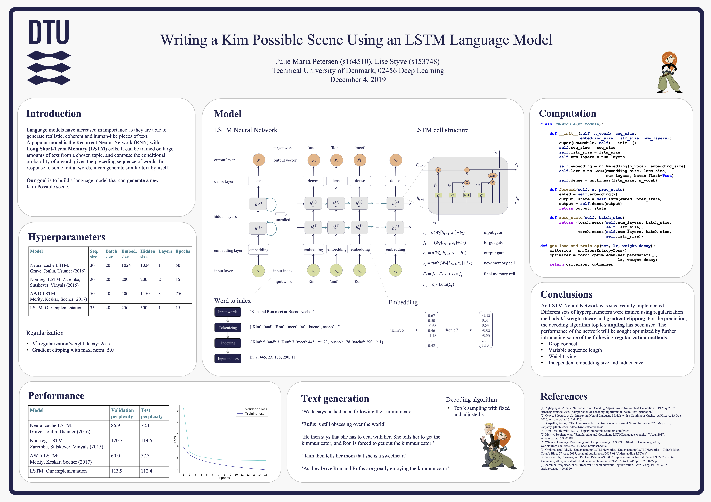

### Language Modelling Using an LSTM Neural Network

This repo consists of the project made in the class 02456 Deep Learning at DTU in the Spring 2020.

In this project, we considered word-level language modelling with a simple objective of predicting the next word given the previous words within some text. This Natural Language Processing (NLP) task was approached with supervised learning using a Recurrent Neural Network (RNN) with Long Short-Term Memory (LSTM) cells. With inspiration from previous research in the field, we accompliced to build a word-level LSTM language model, that when trained on textual data was able to generate similar text sequences. The model was sought optimized and regularized using weight decay and dropout. A validation perplexity of 88.2 was achieved on the task specific data set Penn Treebank (PTB). When trained on other data sets such as storylines of Kim Possible and Harry Potter, the language model enabled to adapt to the style and content of the conditioning text. However the generated sequences were not sufficiently realistic and coherent, due to a continued need for regularization and larger amounts of data.

